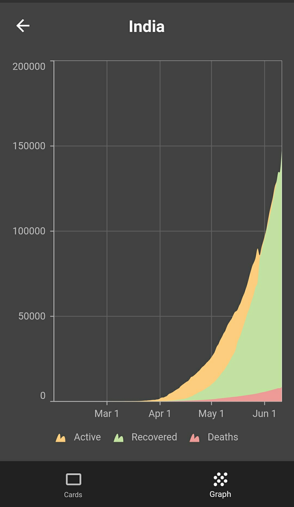

# Trace

#### Trace is a COVID-19 tracking app which shows current stats globally and per country. 

##### Due to the restrictions in the Google Platstore for COVID-19 apps, I was not able to publish it there. But anyhow, you can download it from the release section in this repository. It is using an API covid19api.com for the data.

      

   

